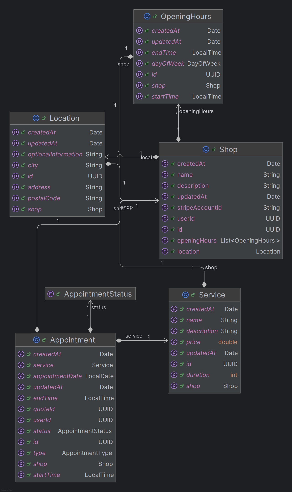

# Documentation du Microservice MS-Shop-API

## Vue d'ensemble

Le microservice **ms-shop-api** est un service Spring Boot qui gère la partie "boutiques" d'une plateforme de services à
domicile. Il fait partie d'une architecture microservices et est responsable de la gestion des boutiques, services,
rendez-vous et horaires d'ouverture.

### Informations générales

- **Nom du projet** : ms-shop-api
- **Framework** : Spring Boot 3.3.4
- **Version Java** : 21
- **Base de données** : MySQL
- **Message Broker** : RabbitMQ
- **Port par défaut** : 8082
- **Context Path** : `/api/ms-shop-api`

## Architecture et Technologies

### Stack technique

- **Spring Boot** : Framework principal
- **Spring Data JPA** : Persistance des données
- **Spring Cloud** : Service discovery
- **Spring AMQP** : Intégration RabbitMQ
- **MySQL** : Base de données principale
- **H2** : Base de données pour les tests
- **MapStruct** : Mapping entre entités et DTOs
- **Lombok** : Réduction du code boilerplate
- **Swagger/OpenAPI** : Documentation API
- **Docker** : Containerisation

### Dépendances externes

- **common-api** : Librairie commune partagée
- **security-api** : Gestion de la sécurité
- **ms-login-api** : Service d'authentification (via Feign Client)

## Modèle de données

### Entités principales



#### 1. Shop (Boutique)

```java
-id:

UUID(Clé primaire)
-name:

String(Nom de la boutique)
-description:

String(Description)
-userId:

UUID(Propriétaire de la boutique)
-stripeAccountId:

String(ID compte Stripe Connect)
-openingHours:List<OpeningHours> (
Horaires d'ouverture)
        -location:

Location(Localisation)
-createdAt/updatedAt:

Date(Timestamps)
```

#### 2. Service

```java
-id:

UUID(Clé primaire)
-name:

String(Nom du service)
-description:

String(Description)
-price:

BigDecimal(Prix)
-duration:

Integer(Durée en minutes)
-shop:

Shop(Boutique associée)
-createdAt/updatedAt:

Date(Timestamps)
```

#### 3. Appointment (Rendez-vous)

```java
-id:

UUID(Clé primaire)
-shop:

Shop(Boutique)
-type:

AppointmentType(SERVICE ou QUOTE)
-service:

Service(Service associé -si type SERVICE)
-quoteId:

UUID(Devis associé -si type QUOTE)
-clientId:

UUID(Client)
-appointmentDate:

LocalDate(Date du RDV)
-startTime:

LocalTime(Heure de début)
-endTime:

LocalTime(Heure de fin)
-status:

AppointmentStatus(Statut)
-stripePaymentIntentId:

String(ID Stripe)
-createdAt/updatedAt:

Date(Timestamps)
```

#### 4. OpeningHours (Horaires d'ouverture)

```java
-id:

UUID(Clé primaire)
-shop:

Shop(Boutique)
-dayOfWeek:

DayOfWeek(Jour de la semaine)
-openTime:

LocalTime(Heure d'ouverture)
        -closeTime:LocalTime(Heure de fermeture)
-isClosed:

Boolean(Fermé ce jour)
```

#### 5. Location (Localisation)

```java
-id:

UUID(Clé primaire)
-shop:

Shop(Boutique)
-address:

String(Adresse)
-city:

String(Ville)
-postalCode:

String(Code postal)
-country:

String(Pays)
-latitude:

Double(Latitude)
-longitude:

Double(Longitude)
```

### Énumérations

#### AppointmentType

- `SERVICE` : Rendez-vous pour un service
- `QUOTE` : Rendez-vous pour un devis

#### AppointmentStatus

- `PENDING` : En attente
- `CONFIRMED` : Confirmé
- `CANCELLED` : Annulé
- `COMPLETED` : Terminé

## API REST

### Endpoints principaux

#### Gestion des Boutiques (`/shop`)

**POST /shop**

- Créer une boutique avec localisation et horaires
- Body: `CreateShopWithLocationAndOpeningHoursDto`
- Response: `CreatedShopDto`

**GET /shop**

- Récupérer toutes les boutiques
- Response: `List<ShopDto>`

**GET /shop/{shopId}**

- Récupérer une boutique par son ID
- Response: `ShopDto`

**GET /shop/user/{userId}**

- Récupérer les boutiques d'un utilisateur
- Response: `List<ShopDto>`

**PUT /shop/{shopId}/stripe-account**

- Mettre à jour le compte Stripe Connect
- Body: `UpdateStripeAccountDto`

#### Gestion des Services (`/service`)

**POST /service**

- Créer un nouveau service
- Body: `CreateServiceDto`
- Response: `CreatedServiceDto`

**GET /service/shop/{shopId}**

- Récupérer les services d'une boutique
- Response: `List<ServiceDto>`

**PUT /service/{serviceId}**

- Mettre à jour un service
- Body: `CreateServiceDto`
- Response: `ServiceDto`

**DELETE /service/{serviceId}**

- Supprimer un service

#### Gestion des Rendez-vous (`/appointment`)

**GET /appointment/shop/{shopId}/duration/{duration}**

- Récupérer les créneaux disponibles
- Query params: `date` (LocalDate)
- Response: `List<LocalTime>`

**POST /appointment**

- Créer un rendez-vous
- Body: `CreateAppointmentRequest`
- Response: `AppointmentDto`

**GET /appointment/shop/{shopId}**

- Récupérer les rendez-vous d'une boutique
- Response: `List<AppointmentResponse>`

**GET /appointment/client/{clientId}**

- Récupérer les rendez-vous d'un client
- Response: `List<AppointmentResponse>`

**PATCH /appointment/{appointmentId}/status/{status}**

- Mettre à jour le statut d'un rendez-vous

## Configuration

### Variables d'environnement

```yaml
# Application
SPRING_APP_PORT=8082

# Base de données
SPRING_DATASOURCE_URL=jdbc:mysql://localhost:3309/db-ms-shop
SPRING_DATASOURCE_USERNAME=user
SPRING_DATASOURCE_PASSWORD=secret

# RabbitMQ
SPRING_RABBITMQ_HOST=localhost
SPRING_RABBITMQ_PORT=5672
SPRING_RABBITMQ_USERNAME=guest
SPRING_RABBITMQ_PASSWORD=guest
```

### Configuration RabbitMQ

Le service utilise RabbitMQ pour la communication asynchrone :

- **Exchange** : `appointments-exchange`
- **Queues** :
    - `appointments-created-queue` : Nouveaux rendez-vous créés
    - `appointments-paid-queue` : Rendez-vous payés

## Déploiement

### Docker Compose

Le projet inclut un fichier `compose.yaml` pour le déploiement local :

```yaml
services:
  server-ms-shop:
    image: redsnoww/ms-shop-api:0.5.0
    ports: ["8082:8080"]
    
  db-ms-shop:
    image: mysql:latest
    ports: ["3308:3306"]
    environment:
      MYSQL_DATABASE: db-ms-shop
      MYSQL_USER: user
      MYSQL_PASSWORD: secret
```

### Scripts de déploiement

- `scripts/build-push-docker.sh` : Construction et push de l'image Docker
- `scripts/start.sh` : Démarrage du service
- `scripts/rename-excutable.sh` : Renommage des exécutables

## Sécurité

### Intégration avec security-api

- Authentification JWT
- Autorisation basée sur les rôles
- Protection des endpoints sensibles

### Intégration Stripe

- Support Stripe Connect pour les paiements
- Gestion des comptes marchands
- Traitement des paiements pour les rendez-vous

## Tests

### Structure des tests

- Tests unitaires des services
- Tests des mappers (MapStruct)
- Tests des utilitaires (ex: gestion des créneaux)

### Exemples de tests

- `AppointmentServiceImplTest` : Tests du service de rendez-vous
- `IAppointmentMapperTest` : Tests du mapping des entités
- `SortedHoursImplTest` : Tests des utilitaires de tri des horaires

## Monitoring et Documentation

### Swagger/OpenAPI

- Documentation interactive disponible sur `/swagger-ui.html`
- Spécifications OpenAPI générées automatiquement
- Tags organisés par domaine fonctionnel

### Logging

- Logs détaillés pour Spring Security
- Logs debug pour les services métier
- Configuration centralisée dans `application.yml`

## Migration de base de données

### Flyway

- Scripts de migration dans `src/main/resources/db/migration/`
- Exemple : `V1__Add_stripe_account_id_to_shop.sql`

## Données de test

### Fichier de données

- `src/main/resources/data/data-test.json` : Données de test prédéfinies

## Architecture des packages

```
com.etna.gpe.mycloseshop.ms_shop_api/
├── config/           # Configuration Spring
├── controllers/      # Contrôleurs REST
│   ├── appointment/
│   ├── service/
│   └── shop/
├── dtos/            # Data Transfer Objects
├── entity/          # Entités JPA
├── enums/           # Énumérations
├── events/          # Événements métier
├── exceptions/      # Gestion des exceptions
├── listeners/       # Listeners d'événements
├── mappers/         # Mappers MapStruct
├── repository/      # Repositories JPA
├── services/        # Services métier
└── utils/           # Utilitaires
```

## Bonnes pratiques

### Conception

- Séparation claire entre contrôleurs, services et repositories
- Utilisation de DTOs pour les API externes
- Mapping automatique avec MapStruct
- Validation des données d'entrée

### Performance

- Lazy loading pour les relations JPA
- Utilisation d'index sur les clés étrangères
- Cache de premier niveau JPA

### Maintenance

- Code documenté avec Swagger
- Tests unitaires complets
- Gestion centralisée des exceptions
- Configuration externalisée

## Points d'attention

### Contraintes métier

- Vérification de la disponibilité des créneaux
- Gestion des conflits de rendez-vous
- Validation des horaires d'ouverture
- Contraintes d'intégrité en base de données

### Intégrations

- Dépendance au service ms-login-api
- Communication asynchrone via RabbitMQ
- Intégration Stripe pour les paiements

Cette documentation fournit une vue d'ensemble complète du microservice ms-shop-api, de son architecture, de ses
fonctionnalités et de son utilisation.
